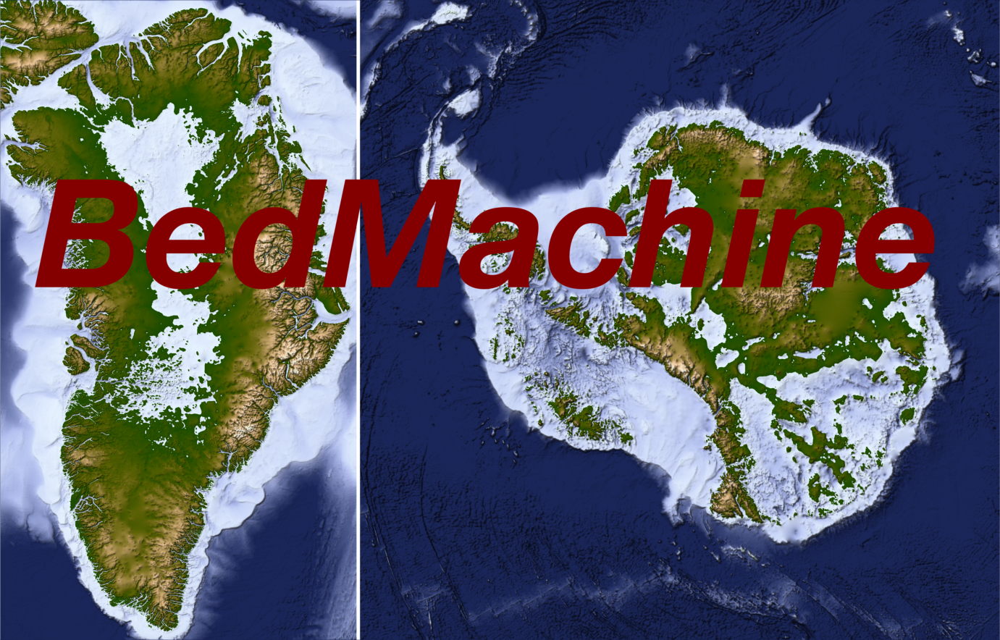
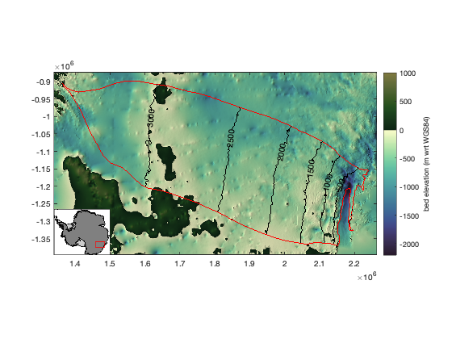
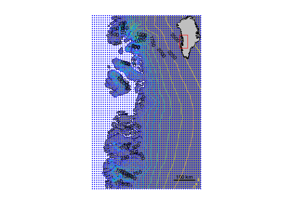
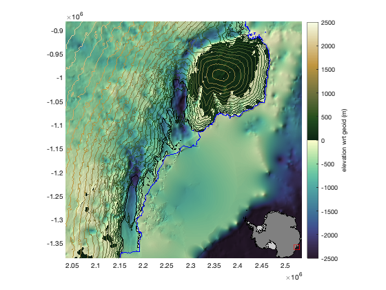
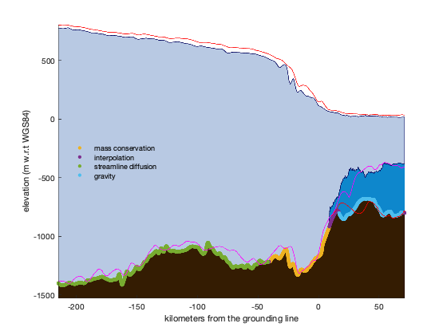

# BedMachine Tools for MATLAB

Matlab tools for loading, interpolating, and displaying BedMachine ice sheet topography.

## Requirements 
* [Antarctic Mapping Tools for Matlab](https://www.mathworks.com/matlabcentral/fileexchange/47638) (Greene et al., 2017) or [Arctic Mapping Tools](https://www.mathworks.com/matlabcentral/fileexchange/63324) if you're analyzing Greenland.
* BedMachine data for [Greenland](https://nsidc.org/data/IDBMG4) or [Antarctica](https://nsidc.org/data/nsidc-0756) (Morlighem et al., 2017 & 2019).

## Contents 
* **`bedmachine_data`** loads the gridded data. 

* **`bedmachine_interp`** interpolates surface elevation, thickness, bed, etc at any locations. 

* **`bedmachine`** plots BedMachine data as imagesc or contour. 

* **`bedmachine_profile`** creates a profile slice along a straight line such as a ship track or flowline. 

* **`bedmachine_3d`** creates a 3D map of BedMachine data. 

##Citing this dataset

If you use BedMachine data, please cite the Morlighem paper listed below. And if this function is useful for you, please do me a kindness and cite my Antarctic Mapping Tools paper.

Morlighem M. et al., (2017), BedMachine v3: Complete bed topography and ocean bathymetry mapping of Greenland from multi-beam echo sounding combined with mass conservation, Geophys. Res. Lett., 44, doi:10.1002/2017GL074954.

Morlighem, M., E. Rignot, T. Binder, D. D. Blankenship, R. Drews, G. Eagles, O. Eisen, F. Ferraccioli, R. Forsberg, P. Fretwell, V. Goel, J. S. Greenbaum, H. Gudmundsson, J. Guo, V. Helm, C. Hofstede, I. Howat, A. Humbert, W. Jokat, N. B. Karlsson, W. Lee, K. Matsuoka, R. Millan, J. Mouginot, J. Paden, F. Pattyn, J. L. Roberts, S. Rosier, A. Ruppel, H. Seroussi, E. C. Smith, D. Steinhage, B. Sun, M. R. van den Broeke, T. van Ommen, M. van Wessem, and D. A. Young. 2019. Deep glacial troughs and stabilizing ridges unveiled beneath the margins of the Antarctic ice sheet, Nature Geoscience. doi:10.1016/j.cageo.2016.08.003.

Greene, C. A., Gwyther, D. E., & Blankenship, D. D. Antarctic Mapping Tools for Matlab. Computers & Geosciences. 104 (2017) pp.151-157. doi:10.1016/j.cageo.2016.08.003.
